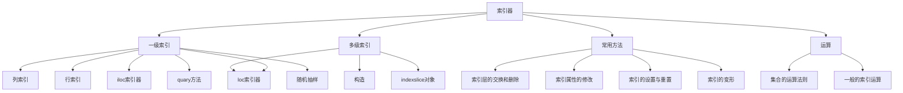
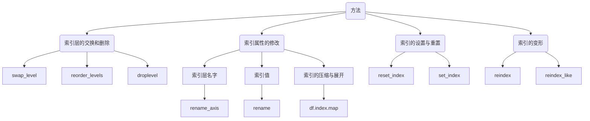
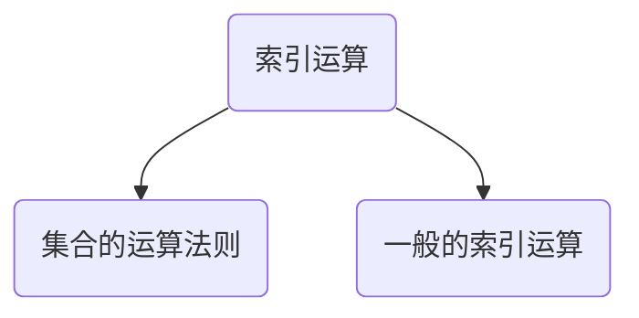

pandas习题

> 补上没有做完的习题:sweat_smile:
>
> ```python
> #EX1 2(c)
> tt=[]
> tt=[(i,j) for i in t1 for j in t2]
> tt1=pd.Series(tt)
> tt2=tt1.values.reshape(-1,1)
> #如何删除tt2中重复的组合呢？
> h1=h[["Type 1","Type 2"]].drop_duplicates()
> #如何从tt2中减去h1呢？
> ```
>
> ```python
> #EX1 3(a)
> def ch(a):
>     b=[]
>     for i in a:
>         if i >120:
>             b.append("high")
>         elif i <50:
>             b.append("low")
>         else:
>             b.append("mid")
>     return b
> pd.Series(ch(h["Attack"]))
> ```
>
> 上面这道题一直在纠结如何使用`mask`,`where`,`clip`函数，最终还是使用了老方法:joy::joy:
>
> ```python
> #3（b）
> m=h["Type 1"]
> n=[]
> for i in m.values:
>    n.append(i.upper())
> n
> pd.Series(n)
> ```
>
> ```python
> #3(c)
> h2=h1.median(axis=1)
> h3=abs(h1.values-h2.values.reshape(-1,1))
> d=[]
> for i, j in zip(h1.values,h3.argmax(axis=1)):
>     d.append(i[j])
> df=pd.Series(d).sort_values()
> df
> ```
>
> ```python
> #EX2 1
> #尚需时间
> ```

---


正式进入今天的任务~

| 尚需多次思考 | 需要解决         | 注意事项  |
| ------------ | ---------------- | --------- |
| :thinking:   | :rotating_light: | :warning: |




<table ><tr><td bgcolor=black align="center"><font face="微软雅黑" color=white>一级索引</font></td></tr></table>

1. <font size=4.5 color=purple>**DataFrame及Series的列索引**</font>

| 类型 |                        | 返回值    |
| ---- | ---------------------- | --------- |
| 单个 | df['Name']             | series    |
| 多个 | df[["Name"，'Gender']] | dataframe |

2. <font size=4.5 color=purple>**Series的行索引**</font>

| 索引   | 单个     | 多个          | 切片                                             |
| ------ | -------- | ------------- | ------------------------------------------------ |
| 字符串 | s["a"]   | s[["a",'"b"]] | s["c":"b",-2]                                    |
| 整数   | s[1]     | s[[1,2]]      | s[1,-1,2]                                        |
|        | 索引元素 | 索引元素      | 索引位置    **整数切片和字符串切片不一样的地方** |

3. <font size=4.5 color=purple>**DataFrame的行索引**</font>

|      | loc索引器 | iloc索引器 |
| ---- | --------- | ---------- |
| 基于 | 元素      | 位置       |
| 形式 | loc[\*,*] | iloc[\*,*] |

- **loc索引器**

  - 单个元素

    - [行]:point_right:取:point_right:Series（一行）或 DataFrame（多行）

    ```python
    b.loc["Qiang Sun"]
    	School	Grade	Gender	Height	Weight	Transfer	Test_Number	Test_Date	Time_Record
    Name									
    Qiang Sun	Tsinghua University	Junior	Female	163.1	53.0	N	1	2019/12/11	0:05:08
    Qiang Sun	Tsinghua University	Sophomore	Female	154.3	40.0	N	1	2019/12/30	0:04:37
    Qiang Sun	Shanghai Jiao Tong University	Junior	Female	160.8	NaN	N	1	2019/9/7	
    # 返回DataFrame
    
    b.loc["Quan Zhao"]
    School         Shanghai Jiao Tong University
    Grade                                 Junior
    Gender                                Female
    Height                                 160.6
    Weight                                    53
    Transfer                                   N
    Test_Number                                2
    Test_Date                          2019/10/4
    Time_Record                          0:03:45
    Name: Quan Zhao, dtype: object
    # 返回Series
    ```

    - [行,列]:point_right:取:point_right:唯一值（一行）或 Series（多行）

  - 元素列表

    - [多行，多列]

    ```python
    b.loc[["Mei Sun","Quan Zhao"],["School","Gender"]]
    
    School	Gender
    Name		
    Mei Sun	Shanghai Jiao Tong University	Male
    Mei Sun	Shanghai Jiao Tong University	Female
    Quan Zhao	Shanghai Jiao Tong University	Female
    ```

  - 切片

    - [行1:行3,列1:列3]

    ```python
    b.loc[:Quan Zhao","School":"Gender"]
    ```

    > :warning:   DataFrame使用整数索引时，整数切片的要求和字符串的要求一样，都是**元素**切片，包含端点且起点、终点不允许有重复值

    :rotating_light: 不是说需要用到slice()方法吗

    ​		是在表示lambda函数时，使用slice(a,b)

  - 布尔运算

    - [condition]

      - 单一条件

      ```python
      b.loc[b["Weight"]>70]
      b.loc[b["Grade"].isin(["Freshman","Senior"])]#多多理解
      ```

      - 复合条件

      ```python
      b.loc[b["Weight"]>70 & b["Grade"]=="Senior"]
      ```

      > :rotating_light:这个语句一直显示出错，原因在哪里？
      >
      > 目测是因为逻辑运算顺序的原因

      ```python
      b.loc[(b["Weight"]>70) & (b["Grade"]=="Senior")]
      #改成这样就好了
      c1=b.School=="Fudan University"
      c2=b.Weight>70
      b.loc[c1&c2]
      ```

      > **练一练**
      >
      > > 利用布尔运算筛选出数据集类型为数值的列
      > >
      > > ```python
      > > b.loc[(b.dtypes==float64)|(b.dtypes==int64)]
      > > ```
      > >
      > > :rotating_light:不知道如何表示 数值型数据，float64

  - 函数

    相当于将布尔运算、切片、多元素等用函数混合起来作为统一条件

    - lambda表达式

    ```python
    b.loc[lambda x:"Quan Zhao",lambda x:"Gender"]
    ```

    前一个匿名函数代表行，后一个代表列

    - slice 切片

    ```python
    b.loc[lambda x:slice("Gaojuan You","Gaoqiang Qian")]
    #对不支持切片的字符型变量使用`slice()`包装
    
    #做对比
    b.loc[:Quan Zhao","School":"Gender"]
    ```

    - :thinking: 使用b.loc方法进行赋值

    ```python
    b.loc[lambda x:"Quan Zhao",lambda x:"Gender"]="male"
    ```

- **iloc索引器**

  - 和loc索引器差不多

    - ```python
      b.iloc[lambda x:slice(3,6),lambda x:slice(3,6)]
      ```

  - 布尔运算

    - ```python
      b.iloc[(b.Weight>80).values]
      ```

      使用布尔运算还需要绕一绕，en，不如loc大法好

4. <font size=4.5 color=purple>**Quary方法**</font>

| 原理                                                         |
| ------------------------------------------------------------ |
| quary帮用户注册了所有来自DataFrame的列名，不需要重复使用DataFrame的名字 |
| **过程**                                                     |


| 应用                                            |
| ----------------------------------------------- |
| :warning:单双引号混合使用，避免报错             |
| :warning:==是等于，=是赋值，不要再忘记啦        |
| :warning:含有空格的列名，使用\`col name ,两个！ |
| :warning:注意逻辑运算符运算规则                 |

```python
b.query("Weight>80")
b.query('(Weight>80) & (Grade=="Senior")')
b.query('(Weight>80) & (Grade=="Senior") & (School=="Fudan University")')
```

| 字符串与列表的比较 |        |                      |
| ------------------ | ------ | -------------------- |
| 类型               | 等价于 | 作用                 |
| ==                 | is in  | 元素出现在列表中     |
| !=                 | not in | 元素没有出现在列表中 |

| 引用外部变量     |
| ---------------- |
| zai外部变量前加@ |

```python
low,high=50,100
b.query('Weight.between(@low,@high)')
```

5. <font size=4.5 color=purple>**随机抽样**</font>

| b.sample() | n    | axis         | frac     | replace  | weights |
| ---------- | ---- | ------------ | -------- | -------- | ------- |
|            | 数量 | 0 行    1 列 | 抽样比例 | 是否放回 | 加权    |

```python
b.query('Weight>80').sample(5,axis=0,weights=[1,2,3,4,5,6,7,8])
```


<table ><tr><td bgcolor=black align="center"><font face="微软雅黑" color=white>多级索引</font></td></tr></table>

> Q：多级索引和索引器的区别在哪里？
>
> 多层索引中元素为元组
>
> ```mermaid
> graph LR
> a(多级索引) --> h(结构)
> a(多级索引) --> b(构造)
> h(结构)--> c(行索引)
> h(结构) --> d(列索引)
> h(结构) --> e(某一层索引)
> c --> `b.index`
> `b.index` --> `b.index.names`
> `b.index`--> `b.index.values`
> d --> `b.columns`
> `b.columns` --> `b.columns.names`
> `b.columns` --> `b.columns.values`
> e --> `get_level_values`
> a --> f(loc索引器)
> a --> g(indexSlice对象)
> 
> ```
>
> 

1. <font size=4.5 color=purple>**结构**</font>

| index        | columns        |           | 某一层           |                                    |
| ------------ | -------------- | --------- | ---------------- | ---------------------------------- |
| index.names  | columns.names  | 列名/行名 | get_level_values | index.get_level_values(0)          |
| index.values | columns.values | 列值/行值 |                  | columns.get_level_values("Height") |

2. <font size=4.5 color=purple>**构造**</font>

| 构造方法1                        |
| :------------------------------- |
| `from_tuples(list(tuple),names)` |

```python
my_tuple=[("a","cat"),("a","dog"),("b","cat"),("b","dog")]
pd.MultiIndex.from_tuples(my_tuple,names=["First","Second"])
```

在**索引**的时候会提到一些元组特殊的用法


| 构造方法2                       |
| :------------------------------ |
| `from_arrays(list(list),names)` |

```python
my_array=[list("aabb"),["cat","dog"]*2]
pd.MultiIndex.from_arrays(my_array,names=["First","Second"])
```


| 构造方法3                         |
| :-------------------------------- |
| `from_products(list(list),names)` |

```python
pd.MultiIndex.from_product([["a","b"],["cat","dog"]],names=["First","Second"])
MultiIndex([('a', 'cat'),
            ('a', 'dog'),
            ('b', 'cat'),
            ('b', 'dog')],
           names=['First', 'Second'])
```

对于有规律的重复，方法3最有效，其次是方法2

> **练一练**
>
> 构造行索引名分别为"School","Gender"，列索引名为“Indicator”,“Grade"
>
> "School"值为A，B         ”Gender“值为Female，Male
>
> ”Indicator“值为Height，Weight          ”Grade“值为Fresh，Senior
>
> ```python
> c=pd.MultiIndex.from_product([["Height","Weight"],["Fresh","Senior"]],names=["Indicator","Grade"])
> r=pd.MultiIndex.from_product([["A","B"],["Female","Male"]],names=["School",'Gender'])
> df=pd.DataFrame((np.random.randn(4,4)*5).tolist(),index=r,columns=c)
> ```
>
> 

3. <font size=4.5 color=purple>**索引器**</font>

:warning:多级索引中元素以**元组**为单位

- 筛选A、Female的同学

  ```python
  dfi=df.sort_index()
  dfi.loc[("A","Female")]#筛选A校女性名单
  ```

> **练一练**
>
> 去除重复索引后进行元素切片

- 关于元组的特殊用法

对多层的元素进行交叉组合后索引，需要指定loc的列，全选用:表示。

每一层需要选中的元素用列表存放，传入loc的形式为`[(list1,list2),cols]`

```python
df.loc[(["A"],["Female"]),:]

#比较两者的区别
df.loc[[("Peking University","Junior"),("Fudan University","Sophomore")]]
df.loc[(["Peking University","Fudan University"],["Junior","Sophomore"]),:]
```

:thinking:还需要好好想想

<font size=4.5 color=purple>**4.IndexSlice对象**</font>

- 解决以下问题：

:negative_squared_cross_mark:  对每层进行切片

:negative_squared_cross_mark:  混合使用切片和布尔运算

- 形式

| 形式 | loc[idx[\*,\*]]                   | loc[idx[\*,\*],idx[\*,\*]]                  |
| ---- | --------------------------------- | ------------------------------------------- |
|      | `df_s.loc[idx["C":,("D","f")：]]` | `df_s.loc[idx[:"A","b":],index["E":,"e":]]` |
|      | 每个元素是一个元组                |                                             |

```python
index=IndexSlice
```


<table ><tr><td bgcolor=black align="center"><font face="微软雅黑" color=white>索引的常用方法</font></td></tr></table>



<font size=4.5 color=purple>**1.索引层的交换和删除**</font>

```python
L1,L2 = ['A','B','C'],['a','b','c']
mul_index1 = pd.MultiIndex.from_product([L1,L2],names=('Upper', 'Lower'))
L3,L4 = ['D','E','F'],['d','e','f']
mul_index2 = pd.MultiIndex.from_product([L3,L4],names=('Big', 'Small'))
df_s = pd.DataFrame(np.random.rand(9,9),index=mul_index1,columns=mul_index2)

df_s.reorder_levels([1,0],axis=1)
df_s.swaplevel(0,1,axis=1)
```

索引层内部交换可以使用`swaplevel()`以及`reorder_levels()`，前者适用两者，后者适用两者及以上

```python
df_s.droplevel(1,axis=1)
df_s.droplevel([0,1],axis=1)
```

`droplevel()`删除某个/某些索引层

:warning:以上两种方法都不会改变原数据

<font size=4.5 color=purple>**2.索引属性的修改**</font>

- 对索引层**名字**的修改


```python
#upper、lower分别变为yeah、no    big变为large
df_s.rename_axis(index={"Upper":"yeah","Lower":"No"},columns={"Big":"large"})
```

- 对索引**值**的修改

```python
#用数字代替字母
df_s.rename(index={"a":1,"b":2,"c":3},columns={"D":4,"E":5,"F":6},level=0)
#效果：只做成了一半
```

:rotating_light:只能设置  行列相同的  索引层level 吗？行列不一样时，Level应该如何表示？

- 替换整个索引**元素**

```python
a=iter(list("123456789"))
df_s.rename(index=lambda x:next(a),level=1)
```

:rotating_light:next（a）起的作用是什么呢？

- 多级索引的**压缩**与**展开**（A-a）

除了`droplevel`，这里可以**改变索引层数量**

```python
#压缩
df_s.index=df_s.index.map(lambda x:x[0]+'-'+x[1])
df_s
#展开
df_S.index.map(lambda x:tuple(x.split("-")))
#我可能会忘了tuple函数
```

`map`方法是定义在`index`上，只能应用在行上

<font size=4.5 color=purple>**3.索引的设置与重置**</font>

同样，改变**索引数量**

```python
df_s.reset_index("Upper",drop=True)#append=True 表示丢弃Upper索引
df_s.droplevel("Upper")
#两者效果一样

df_s.reset_index("Upper").set_index("Upper",append=True)
#append=True 表示添加新索引，False表示代替
```

<font size=4.5 color=purple>**4.索引的变形**</font>

和`rename_axis`单纯改变索引名字不一样，`reindex`可以_________________

`reindex_like`相当于格式刷

:rotating_light:应用在多重索引上呢？


<table ><tr><td bgcolor=black align="center"><font face="微软雅黑" color=white>索引运算</font></td></tr></table>



<font size=4.5 color=purple>**1.集合的运算法则**</font>

| 交集               | 并集         | 补集                        | S1-S2             |
| ------------------ | ------------ | --------------------------- | ----------------- |
| S1.interaction(S2) | S1.union(S2) | S1.symmetric_difference(S2) | S1.difference(S2) |
| S1 & S2            | S1 \| S2     | S1 ^ S2                     | (S1 ^ S2) & S1    |

 Q: 两张表需要做集合运算的列没有设置索引

```python
S1[S1.id.isin(S2)]
```

:thinking:思考思考


<table ><tr><td bgcolor=black align="center"><font face="微软雅黑" color=white>练习</font></td></tr></table>

1. ```python
   dt=pd.read.csv("company.csv")
   ```

   

- 分别只使用 `query` 和 `loc` 选出年龄不超过四十岁且工作部门为 `Dairy` 或 `Bakery` 的男性。

```python
dt.loc[(dt.age<40)&dt.department.isin(["Dairy","Bakery"])&(dt.gender=="M")]
dt.query('age<40 & department.isin(["Dairy","Bakery"])& (gender=="M")')
```

- 选出员工 `ID` 号 为奇数所在行的第1、第3和倒数第2列。

  ```python
  dt.loc[dt.EmployeeID/2!=0,["EmployeeID","age","job_title"]]
  ```
  
  按照以下步骤进行索引操作：

* 把后三列设为索引后交换内外两层

```python
dt.set_index(["city_name","job_title","gender"]).swaplevel(0,2,axis=0)
```

* 恢复中间一层

```python
dt.reset_index("job_title")
```

* 修改外层索引名为 `Gender`

```python
dt.rename_axis(index={"gender":"Gender"})
```

* 用下划线合并两层行索引

```python
dt.index=dt.index.map(lambda x:(x[0]+"_"+x[1]))
```

* 把行索引拆分为原状态

```python
dt.index=dt.index.map(lambda x:tuple(x.split("_")))
#报错！
```

* 修改索引名为原表名称

```python
dt.reset_index()
```

* 恢复默认索引并将列保持为原表的相对位置

```python
#更换列变量
```


2. ```python
   tn=pd.read_csv('chocolate.csv')
   ```

- 把列索引名中的 `\n` 替换为空格。
- 巧克力 `Rating` 评分为1至5，每0.25分一档，请选出2.75分及以下且可可含量 `Cocoa Percent` 高于中位数的样本。

- 将 `Review Date` 和 `Company Location` 设为索引后，选出 `Review Date` 在2012年之后且 `Company Location` 不属于 `France, Canada, Amsterdam, Belgium` 的样本。

**参考文章**

1. https://cloud.tencent.com/developer/article/1638534

2. joyfulpandas  by DataWhale